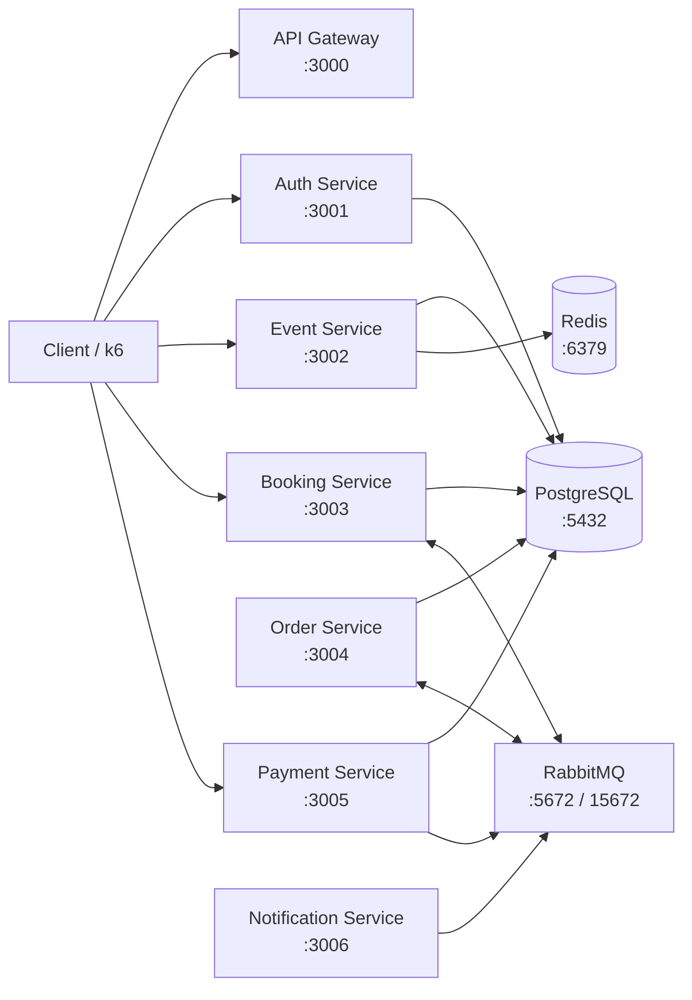
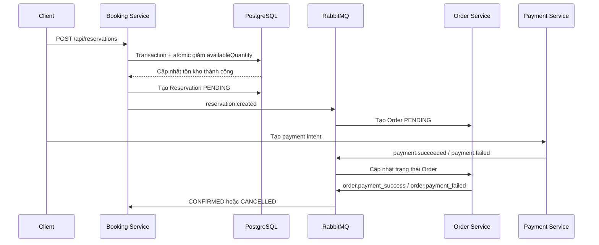

# Hướng dẫn Khởi động Nhanh cho ticket-booking-backend

Chào mừng bạn đến với dự án **ticket-booking-backend**! Đây là tài liệu hướng dẫn nhanh giúp bạn thiết lập môi trường phát triển cục bộ và làm quen với các câu lệnh cơ bản.

---

### 📋 1. Yêu cầu Hệ thống (Prerequisites)

Trước khi bắt đầu, hãy đảm bảo máy tính của bạn đã cài đặt các công cụ sau:

- **Node.js:** Phiên bản >= 18.x (Khuyến nghị sử dụng NVM để quản lý).
- **Docker & Docker Compose:** Dùng để chạy hạ tầng (PostgreSQL, Redis, RabbitMQ).
- **k6 (Tùy chọn):** Cần thiết nếu bạn muốn chạy kiểm thử tải (Load Testing).

---

### 🛠️ 2. Các bước Thiết lập Môi trường

**Bước 1: Clone dự án và cài đặt dependencies**

Sử dụng `npm` để cài đặt tất cả các gói trong Monorepo:

```bash
npm install

```

**Bước 2: Cấu hình biến môi trường (.env)**

Tạo file `.env` ở thư mục gốc từ mẫu có sẵn:

```bash
cp .env.example .env

```

_Cấu hình các giá trị cần thiết cho Database, Redis, RabbitMQ và các Secret Key bên trong file `.env`._

**Bước 3: Khởi động Hạ tầng với Docker**

Chạy hạ tầng cơ sở dữ liệu và message broker dưới nền:

```bash
docker-compose -f .development/docker-compose.yml up -d

```

_(Lệnh này sẽ khởi động PostgreSQL, Redis và RabbitMQ kèm cơ chế tự kiểm tra sức khỏe container)_

**Bước 4: Khởi động các Microservices**

Chạy đồng loạt tất cả các service bằng Nx:

```bash
npx nx run-many --target=serve --all

```

---

### 💻 3. Các câu lệnh phát triển thường dùng

Các câu lệnh sau được chạy ở thư mục gốc của monorepo:

- **Chạy riêng một service (ví dụ: auth-service):**

```bash
npx nx serve auth-service

```

- **Build toàn bộ các service:**

```bash
npx nx run-many --target=build --all

```

- **Chạy kiểm thử tải với k6 (Flash sale simulation):**

```bash
k6 run --env-file .env k6/flash-sale.js

```

- **Dừng toàn bộ hạ tầng Docker:**

```bash
docker-compose -f .development/docker-compose.yml down

```

---

### 🏗️ 4. Architecture

Hệ thống được tổ chức theo mô hình **Nx Monorepo** và kiến trúc **microservices**:



#### Luồng đặt vé



Các thành phần chính:

- **API Gateway:** cổng vào HTTP của hệ thống; hiện tại đang là service mẫu.
- **Auth Service:** đăng ký, đăng nhập và phát hành JWT.
- **Event Service:** quản lý event, ticket tier và tồn kho cấu hình.
- **Booking Service:** giữ vé, tạo reservation, xử lý hủy và tự động expire.
- **Order Service:** tạo order, cập nhật trạng thái thanh toán và phát hành ticket.
- **Payment Service:** tạo payment intent và xử lý callback VNPay.
- **Notification Service:** service dành cho các luồng thông báo qua message broker.
- **PostgreSQL:** lưu trữ dữ liệu nghiệp vụ và xử lý transaction tồn kho.
- **RabbitMQ:** giao tiếp bất đồng bộ giữa Booking, Order, Payment và Notification.
- **Redis:** cache dữ liệu đọc, hiện được sử dụng trong Event Service.
- **libs/common:** module dùng chung cho database, JWT, guards và decorators.
- **libs/entities:** entity TypeORM cùng Zod Schema/DTO dùng chung.

---

### 📂 4. Cấu trúc thư mục Monorepo

- `/apps/auth-service`: Dịch vụ quản lý xác thực và người dùng.
- `/apps/event-service`: Dịch vụ quản lý sự kiện và cấu hình hạng vé.
- `/apps/booking-service`: Dịch vụ xử lý đặt vé, giữ chỗ và chống tranh chấp dữ liệu.
- `/apps/order-service`: Dịch vụ quản lý vòng đời và trạng thái đơn hàng.
- `/apps/payment-service`: Dịch vụ tích hợp cổng thanh toán (VNPay).
- `/libs/common`: Thư viện dùng chung cấu hình database, jwt, guards và interceptors.
- `/k6`: Kịch bản kiểm thử tải mô phỏng lượng truy cập lớn.
